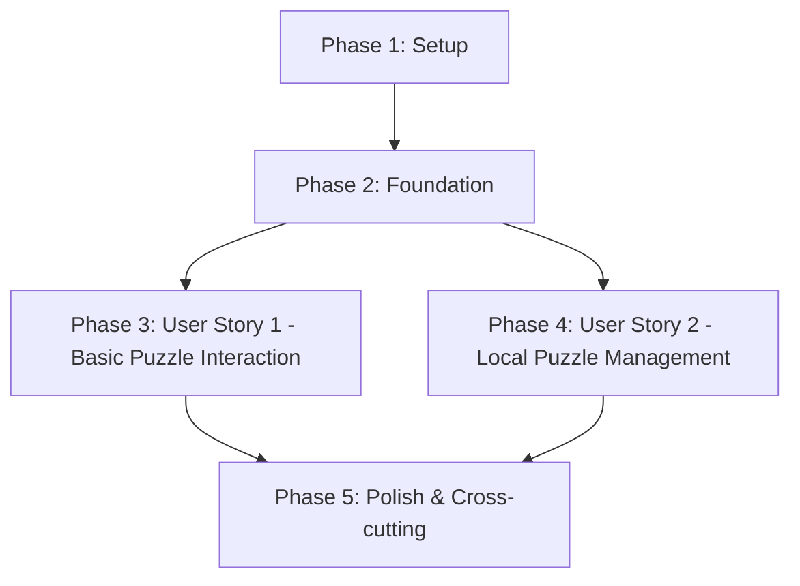

# Implementation Tasks: Local Puzzle Grid Architecture

## Overview

This task breakdown follows the implementation plan and specification, organizing work by user stories to enable independent implementation and testing. Each phase is designed to deliver testable value.

## Dependencies Graph

## Phase 1: Setup

### Project Initialization
- [ ] T001 Create backend project structure
- [ ] T002 Create frontend project structure
- [ ] T003 [P] Initialize backend package.json and install core dependencies
- [ ] T004 [P] Initialize frontend package.json and install core dependencies
- [ ] T005 Create data directory structure

### Development Environment
- [ ] T006 [P] Set up ESLint and Prettier for backend
- [ ] T007 [P] Set up ESLint and Prettier for frontend
- [ ] T008 [P] Configure Jest for backend testing
- [ ] T009 [P] Configure Playwright for E2E testing
- [ ] T010 Create development scripts in package.json files

## Phase 2: Foundation

### Core Infrastructure
- [ ] T011 Create basic Express server setup in backend/src/index.ts
- [ ] T012 [P] Set up frontend development server in frontend/src/index.html
- [ ] T013 Configure CORS for local development
- [ ] T014 Implement basic error handling middleware

### Storage Layer
- [ ] T015 Implement file system utilities in backend/src/services/storage.ts
- [ ] T016 Create storage service tests in backend/tests/unit/services/storage.test.ts
- [ ] T017 Set up puzzle file indexing system

### Constraint Engine Core
- [ ] T018 Create constraint engine types in backend/src/lib/constraint-engine/types.ts
- [ ] T019 Implement core constraint validation logic
- [ ] T020 Create constraint engine tests

## Phase 3: User Story 1 - Basic Puzzle Interaction
**Goal**: Enable loading a puzzle and making basic cell selections with constraint propagation.

### Backend Implementation
- [ ] T021 [US1] Create Puzzle model in backend/src/models/puzzle.ts
- [ ] T022 [P] [US1] Create PuzzleState model in backend/src/models/state.ts
- [ ] T023 [US1] Implement puzzle loading endpoint in backend/src/routes/puzzle.ts
- [ ] T024 [US1] Create cell marking endpoint in backend/src/routes/state.ts
- [ ] T025 [US1] Implement constraint propagation service

### Frontend Implementation
- [ ] T026 [P] [US1] Create Grid component in frontend/src/components/Grid/index.ts
- [ ] T027 [P] [US1] Implement cell selection handlers
- [ ] T028 [US1] Create API client service in frontend/src/services/api.ts
- [ ] T029 [US1] Implement state management service
- [ ] T030 [US1] Add basic grid styling

### Integration
- [ ] T031 [US1] Create sample puzzle file for testing
- [ ] T032 [US1] Implement E2E test for basic puzzle interaction
- [ ] T033 [US1] Add error handling for invalid moves

## Phase 4: User Story 2 - Local Puzzle Management
**Goal**: Enable storing and managing puzzle files locally.

### Backend Implementation
- [ ] T034 [US2] Create puzzle file validation service
- [ ] T035 [US2] Implement puzzle listing endpoint
- [ ] T036 [US2] Add puzzle state persistence service
- [ ] T037 [P] [US2] Create file watching service for puzzle updates

### Frontend Implementation
- [ ] T038 [P] [US2] Create puzzle selection interface
- [ ] T039 [US2] Implement auto-save functionality
- [ ] T040 [US2] Add puzzle reload capability
- [ ] T041 [P] [US2] Create basic puzzle management UI

### Integration
- [ ] T042 [US2] Create E2E tests for puzzle management
- [ ] T043 [US2] Implement error handling for file operations
- [ ] T044 [US2] Add file system permission checks

## Phase 5: Polish & Cross-cutting

### Performance Optimization
- [ ] T045 Add response caching for puzzle data
- [ ] T046 Implement batch updates for cell changes
- [ ] T047 Add puzzle preloading

### Error Handling & Reliability
- [ ] T048 Add comprehensive error boundaries
- [ ] T049 Implement auto-recovery for corrupted states
- [ ] T050 Add validation for all user inputs

### Developer Experience
- [ ] T051 [P] Create sample puzzle generator script
- [ ] T052 [P] Add development documentation
- [ ] T053 Add logging for debugging
- [ ] T054 Create production build configuration

## Implementation Strategy

### MVP Scope (User Story 1)
- Basic puzzle grid display
- Cell selection and marking
- Simple constraint propagation
- State persistence

### Parallel Execution Opportunities

**Setup Phase**:
- Frontend and backend setup can be done in parallel
- Testing setup can be done alongside project setup

**User Story 1**:
- Grid component development parallel with backend models
- API client service parallel with endpoints

**User Story 2**:
- File watching service parallel with UI
- Management interface parallel with backend services

### Testing Strategy

**Contract Tests**:
- API endpoints (T023, T024)
- File operations (T015, T034)

**Integration Tests**:
- Puzzle interaction flow (T032)
- Puzzle management flow (T042)

**Unit Tests**:
- Constraint engine (T020)
- Storage service (T016)

## Task Counts
- Total Tasks: 54
- Setup Phase: 10 tasks
- Foundation Phase: 10 tasks
- User Story 1: 13 tasks
- User Story 2: 11 tasks
- Polish Phase: 10 tasks
- Parallelizable Tasks: 15

## Notes
- All tasks have specific file paths
- Each user story phase is independently testable
- Parallel tasks marked with [P]
- Clear dependencies between phases
- Constitution-compliant approach with test coverage